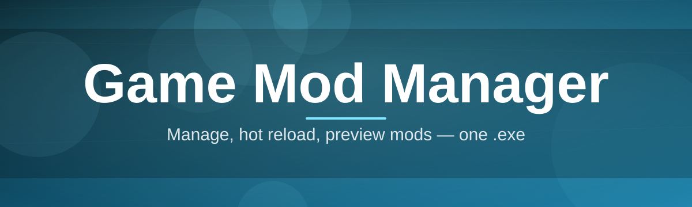
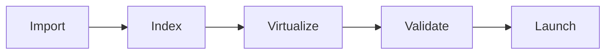

# mod-mgr-suite 🧩🔥

  

*One mod manager to rule your load order, and stop your Documents folder from becoming a crime scene.*

  

## 🎮 Overview

Let's be honest: manually managing game mods is a punishment nobody signed up for. You download a `.zip`, you extract it into fifteen nested folders, something overwrites your textures, your load order looks like abstract art, and three hours later your game won't boot past the title screen. **mod-mgr-suite** exists because we got tired of writing the same "just reinstall and start over" advice in Discord servers. This is a dedicated Game Mod Manager built for people who mod seriously — not casually dragging one file into a game directory, but running fifty-plus mods with conflicting dependencies and opinions about who loads first.

At its core, this tool is a virtual file system, a dependency-aware load order engine, and a profile manager wearing a trench coat that looks like a normal desktop app. It sits between your mod archives and your actual game installation, so nothing ever touches your base game files directly. That means broken mods, bad patches, and "oops wrong version" moments become a two-click undo instead of a full reinstall. Whether you're modding an open-world RPG, a survival sandbox, or a decade-old cult classic that only survives *because* of its modding scene, mod-mgr-suite treats your setup with the seriousness it deserves.

We built this for the modding community first — the people who write mods, the people who test them, and the people who just want their fiftieth playthrough to actually launch. If you've ever lost a save file to a bad merge or spent a weekend troubleshooting a "missing master" error, you are exactly who this project is for.

  

---

## ⚡ What It Actually Does

> [!TIP]
> If you only read one section, read this one. Everything else is context.

- **Virtual mod staging** — mods live in isolated folders and get virtually linked into your game directory, so your vanilla install stays untouched no matter how chaotic your load order gets.

- **Drag-and-drop conflict resolution** — when two mods fight over the same file, you get a visual diff instead of a coin flip, so you decide who wins, not the file system.

- **Dependency-aware load ordering** — the engine reads mod metadata and warns you *before* launch if something's missing, outdated, or loaded in the wrong order.

- **One-click profile switching** — keep a "vanilla-plus," a "total overhaul," and a "streaming setup" profile side by side, and swap between them without touching a single file manually.

- **Automatic backup snapshots** — every profile change is checkpointed, so a bad mod update is an undo, not a disaster recovery mission.

- **Built-in archive handling** — supports common mod archive formats out of the box, no separate extraction tool required.

- **Plugin/master file sanity checks** — flags orphaned masters, circular dependencies, and duplicate plugin IDs before they crash your session.

- **Search-first mod library** — tag, filter, and sort your installed mods by category, author, or last-updated date instead of scrolling a giant flat list.

---

## 🚀 Getting Started

<strong>Click to expand — from zero to modded in under 5 minutes</strong>

1. Visit the project landing page (the download button above) and grab the latest release package.

2. Run the standalone executable — no installer wizard, no bundled toolbars, no surprise dependencies.

3. Point mod-mgr-suite at your game's install directory when prompted on first launch.

4. Drop your mod archives into the library view, arrange your load order, and hit **Launch** — that's it.

> [!NOTE]
> First launch does a one-time scan of your game directory to build its internal index. On a slow drive this can take a minute — that's normal, not a freeze.

---

## 🖥️ System Requirements

| Requirement | Details |
|---|---|
| **OS** | Windows 10 or Windows 11 (64-bit) |
| **Dependencies** | None — fully standalone executable |
| **Disk space** | ~150 MB for the app, plus space for staged mods |
| **RAM** | 4 GB minimum, 8 GB recommended for large mod libraries |
| **Permissions** | Standard user; admin only needed if your game folder is under Program Files |

> [!IMPORTANT]
> mod-mgr-suite does not require .NET, Java, or any external runtime to be preinstalled. If a page tells you otherwise, you're not on the official landing page.

---

## 🛠️ How It Works

<strong>The pipeline, from archive to launch</strong>

The whole system is built around **never writing to your original game files**. Here's the flow every mod takes:

1. **Import** — a mod archive is unpacked into an isolated staging folder, untouched by anything else.

2. **Index** — metadata (dependencies, version, file list) is parsed and added to your library.

3. **Virtualize** — enabled mods are virtually linked into the game directory in load-order sequence, without physically copying files.

4. **Validate** — the conflict and dependency checker runs a pass before launch and flags anything risky.

5. **Launch** — the game boots against the virtual overlay, and your real install directory remains exactly as it was.

---

## 🩹 Troubleshooting

<strong>Q: My mod shows as enabled but doesn't seem to load in-game.</strong>

Check your load order first — a lower-priority mod may be getting silently overwritten by one loaded after it. The conflict panel will highlight this in orange.

<strong>Q: The app says "missing master" for a mod I definitely installed.</strong>

This usually means a dependency mod is disabled, not just uninstalled. Re-enable it in your library, or check the mod's page for the exact required version.

<strong>Q: My game crashes on launch after adding a new mod.</strong>

Use the automatic snapshot from before you added the mod to roll back instantly, then re-add mods one at a time to isolate the culprit.

<strong>Q: Can I run multiple games with separate mod libraries?</strong>

Yes — each game gets its own isolated library and profile set. Nothing crosses over unless you explicitly export/import a profile.

<strong>Q: I switched profiles and now half my mods are gone.</strong>

They're not gone — profiles are independent load-order sets. Switch back to your previous profile and they'll reappear exactly as configured.

> [!WARNING]
> Always let mod-mgr-suite fully close before manually editing anything in your game's mod folder — doing it mid-session can desync the virtual overlay from what's on disk.

---

## 🎨 UI & UX Details

- **Themes** — Dark (default), Light, and a high-contrast mode for long modding sessions at 2 AM.

- **Keyboard shortcuts**:

  | Action | Shortcut |
  |---|---|
  | Toggle mod on/off | `Space` |
  | Move mod up/down in load order | `Ctrl + ↑ / ↓` |
  | Open conflict resolver | `Ctrl + K` |
  | Quick search library | `Ctrl + F` |
  | Launch game | `F5` |

- **Settings** live in a single unified panel — no hunting through nested menus to find where the backup interval is configured.

- Drag handles, hover previews, and inline tags make large mod libraries feel like a library, not a spreadsheet.

---

## 🤝 Contributing & Community

This project grows because modders talk to each other, not because of a corporate roadmap. If you've got a feature idea, a bug, or a niche game you want better supported:

- Open an **Issue** for bugs — include your log file, it saves everyone a round trip of questions.

- Start a **Discussion** for feature requests, workflow ideas, or "is this even possible" questions.

- Check the pinned roadmap discussion before opening a duplicate feature request — chances are it's already being debated.

- Pull requests are welcome, especially around new archive format support and additional game profile templates.

> [!TIP]
> The fastest way into the contributor circle is fixing a "good first issue" label and joining the discussion thread for it — that's basically our onboarding process.

  

---

## 📜 License

Released under the [MIT License](LICENSE), 2026. Use it, fork it, build your own weird mod tooling on top of it — just keep the license notice intact.

---

## ⚠️ Disclaimer

> [!NOTE]
> mod-mgr-suite is an independent, community-driven tool and is not affiliated with, endorsed by, or sponsored by any game developer or publisher. It manages files you already own the rights to use — it doesn't provide mod content itself. Mod responsibly, back up your saves, and respect individual mod authors' terms of use.

---

  

